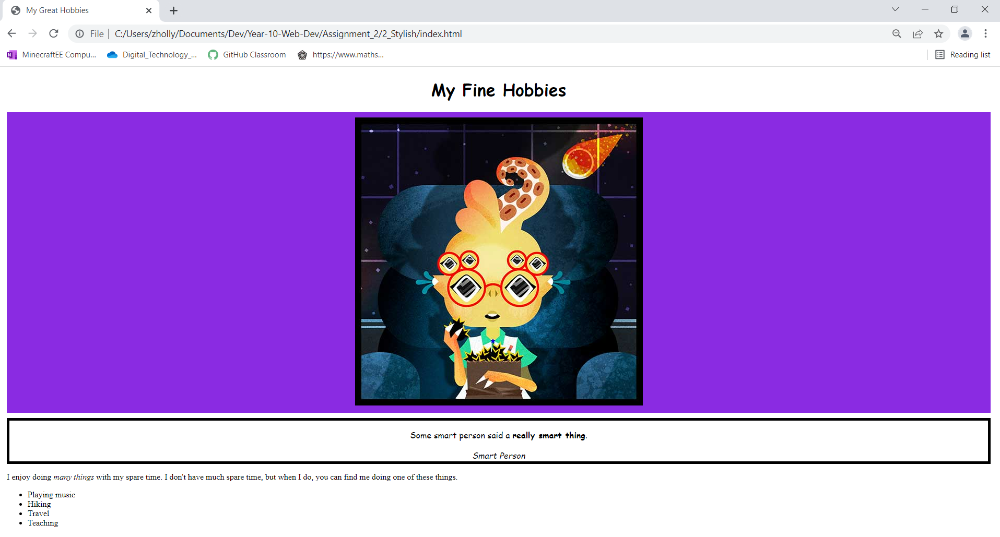

# Take the given html content and make it your own!
Given the provided html file, customize the content so it tells us a bit about yourself. What's your favorite quote? What do you enjoy doing in your spare time? Replace the four hobbies in the unordered list at the bottom and replace them with your own. Lastly, link a style sheet and make the following adjustments to the layout style.

1. Center the text in the h1 tag and change the font family to cursive
2. Center the image. Change the background to blueviolet. Add 10px of padding and 10px of margin.
3. Center the blockquote. Change the font family to cursive. Make sure that the font size is set to 1em. Add a 5px solid black border. Add 10px of margin
4. Make the cite tag italic.
5. Add 10px of margin to the about me tag.

Your final image should look like this:

