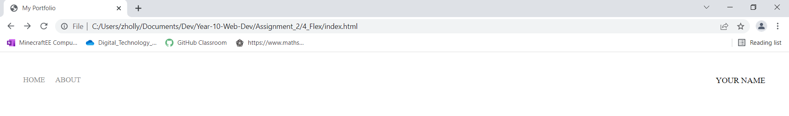
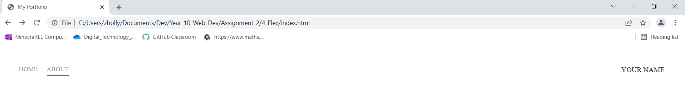

# Take the given html content and make it your own!
Given the provided html and css link the index.html and about.html to each other. Link the css file and make the following additions to the css file. 

1. Using Flex Box, position the home and about links on the left side of the page and your name on the right. 
2. Transform your name into all caps using css.
3. Add 38px of padding to the nav-wrapper.
4. On the left side add 20px of padding to the Home and About links. And make all caps using css.
4. Make the height of the nav-link-wrapper 22px and add a bottom border 1px solid black.
5. Change the color of the links, home and about, to #8a8a8a. Remove all text decoration. 
6. EXTRA POINTS! Add a hover state to the links. Must deliver a 0.5 second transition for the bottom border only.

**HTML Note:**
Both Home and About must be on each page. Add something to both Home and About to let us know that we are on those pages.

Your final image should look like this:

**Without Hover**

**With Hover**
