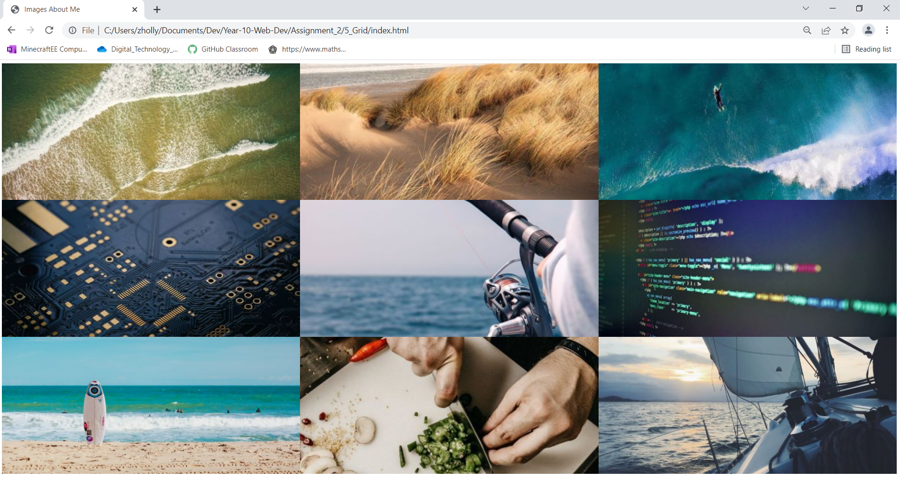

# Put that Image in a Grid!
Given the provided html file, customize the content so it tells us a bit about yourself. Download 9 images and save them to the image folder provided. These images should help tell a story about yourself. Keep these images professional, it could be apart of your job interview one day! Load the images up into the provided html file and style it.

1. Make a 3 x 3 Grid of images with no padding no margin. 
2. The grid row needs to me a minimum size of 100px.
3. Image height should be 350px with a width of 100%.
4. The images should not repeat, should be centered in the grid box, and cover the entire box.

Your final page should look like this, but with your own images:

