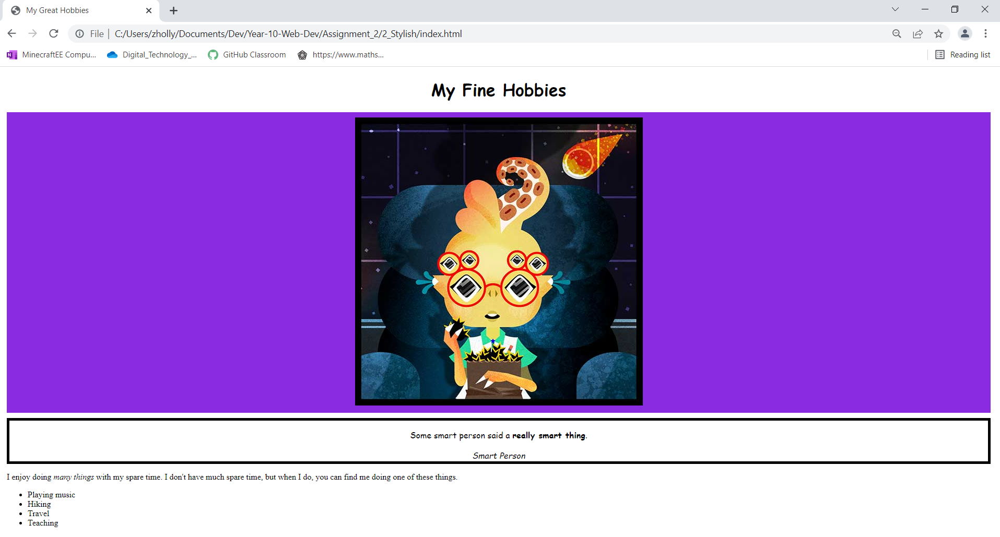

# 🚀 Welcome to Year 10 Web Dev KKHS! 💻

This repository is designed to introduce Year 10 students to the basics of web development. Whether you're looking to build a personal website, create a project for a class, or simply explore the exciting world of coding, this course is for you!

💡 In this course, you will learn the fundamental building blocks of websites, including HTML, CSS. You'll learn how to build beautiful, functional pages from scratch, and gain a solid understanding of how the web works.

🎓 By the end of the course, you will have created your very own website, and be well on your way to becoming a web developer!

👨‍💻 Let's get started!

📚 The course consists of several modules, each covering a different aspect of web development. Simply follow along with the lessons, and you'll be building websites in no time!

🤔 If you have any questions along the way, feel free to ask for help in the issues section of this repository. We're here to support you!

💻 Happy coding!

# Assignment 1 - Web components
[Link](./Assignment-1-web-components.md)

## 🕵️‍♀️ Website Components Assignment 🕵️‍♂️
In this assessment, you will be identifying components that make up a website. 

💻 The assessment consists of several components that are commonly found in websites. Take a screenshot using windows + shift + s and add a picture in each of the boxes.

🎓 Upon completion of the assessment, make sure to save your work and *push* it back up to github using github desktop. 

👨‍💻 *This task is worth 10% of your overall mark*

💪 Good luck!

# Assignment 2 - HTML and CSS

## 📚 Web Development Assignment 2 📚

This is your second assignment for Web Development. Your task/Hei Mahi, consists of 6 parts, each of which is contained in a separate file.

*Combined this is worth 35% of your mark*

📚 **You need to complete 7 parts**
1. My First Website
2. My Food Blog
3. Book Mark Up exercise
4. Stylish exercise
5. Flex\navbar exercise 
6. Grid exercise

## Part 1 - My First Website
[link](./classwork/1-my-first-website.html)

Create a basic website using html. 

## Part 2 - My Food Blog
[link](./classwork/2-my-food-blog.html)

Create a food blog using h1, p, img, ol, ul, li tags

## Part 3 - Book mark up excercise
[link](./classwork/3-book.txt)

Use your knowledge of html tags to correctly format text

Include a head, title, body, html tags

Correctly handle formatting the lists, and the link

Add as much detail to the html as you can including quote and blockquote tags

## Part 4 - Stylish
[link](./classwork/4-stylish.html)

### Take the given html content and make it your own!
Given the provided html file, customize the content so it tells us a bit about yourself. What's your favorite quote? What do you enjoy doing in your spare time? Replace the four hobbies in the unordered list at the bottom and replace them with your own. Lastly, link a style sheet and make the following adjustments to the layout style.

1. Center the text in the h1 tag and change the font family to cursive
2. Center the image. Change the background to blueviolet. Add 10px of padding and 10px of margin.
3. Center the blockquote. Change the font family to cursive. Make sure that the font size is set to 1em. Add a 5px solid black border. Add 10px of margin
4. Make the cite tag italic.
5. Add 10px of margin to the about me tag.

Your final image should look like this:

## Part 5 
[link](./classwork/5-navbar.html)

### Take the given html content and make it your own!
Given the provided html and css link the index.html and about.html to each other. Link the css file and make the following additions to the css file. 

1. Using Flex Box, position the home and about links on the left side of the page and your name on the right. 
2. Transform your name into all caps using css.
3. Add 38px of padding to the nav-wrapper.
4. On the left side add 20px of padding to the Home and About links. And make all caps using css.
4. Make the height of the nav-link-wrapper 22px and add a bottom border 1px solid black.
5. Change the color of the links, home and about, to #8a8a8a. Remove all text decoration. 
6. EXTRA POINTS! Add a hover state to the links. Must deliver a 0.5 second transition for the bottom border only.

**HTML Note:**
Both Home and About must be on each page. Add something to both Home and About to let us know that we are on those pages.

Your final image should look like this:

**Without Hover**

**With Hover**

## Part 6 - Grid 
[link](./classwork/6-grid.html)
### Put that Image in a Grid!
Given the provided html file, customize the content so it tells us a bit about yourself. Download 9 images and save them to the image folder provided. These images should help tell a story about yourself. Keep these images professional, it could be apart of your job interview one day! Load the images up into the provided html file and style it.

1. Make a 3 x 3 Grid of images with no padding no margin. 
2. The grid row needs to me a minimum size of 100px.
3. Image height should be 350px with a width of 100%.
4. The images should not repeat, should be centered in the grid box, and cover the entire box.

Your final page should look like this, but with your own images:

--- 
--- 

# Web Dev Final Assessment 
[link](./Final-Project/index.html)

Hi Year 10s

This is the Final Assessment for your Web Dev Unit. 

*This task is worth 55% of your mark*

Task/Hei Mahi
You are to create a multi-page website that promotes you! You may either use the design template provided or come up with your oun layout. Your objective is to have a functioning website that will inform your future potential employers about projects that you've done durring your time in high school. 

**Your website must:**
 *	use CSS
 *	have Images optimised for webpages
 *	have a multi-page website that includes images and text
 *	be formatted so that it is easy to read and navigate 
 
**You must: If you choose to re-design**
 *	clear your design plan with the teacher
 *	Use and apply relevant conventions to improve the quality of the outcome.

**Web conventions may include:**
 *	Proper naming of pages and assets (lowercase, hyphens, full names, no spaces)
 *	Fonts – web fonts accessible from all platforms 
 *	Images – appropriate sizes and formats for web and purpose, i.e use of thumbnail images in a gallery, backgrounds removed where applicable. 
 *	Tags – opened and closed correctly, same case throughout.

**You also need to provide evidence showing:**
 *	trialling font and colour combinations
 *	trialling various layouts for text and images
 *	testing that assets/images and pages are linked correctly
 *	testing for consistency of layout and styles

 **You must have one portfolio entry**
*   your entry must document how you built this website
*   your entry must include a short instruction about how you enter an additional project into the website

Below is the provided website design layout your you to follow with all of the styling requirements needed to achieve the same look. 

# Portfolio Home Page

**Navigation Bar**
1. Using Flex Box, position the home and about links on the left side of the page and your name on the right. 
2. Transform your name into all caps using css.
3. Add 38px of padding to the nav-wrapper.
4. On the left side add 20px of padding to the Home and About links. And make all caps using css.
4. Make the height of the nav-link-wrapper 22px and add a bottom border 1px solid black.
5. Change the color of the links, home and about, to #8a8a8a. Remove all text decoration. 

**Image Grid**
1. Make a 3 x 3 Grid of images with no padding no margin. 
2. The grid row needs to me a minimum size of 100px.
3. Image height should be 350px with a width of 100%.
4. The images should not repeat, should be centered in the grid box, and cover the entire box.

# Portfolio About Page

1. Must include a navigation bar wiht student name on the left
2. Make page layout two columns, image on the left and content on the right.
3. Make the image 100% width.
4. Add 30px of padding to the content on the right.
5. Add an h1 header with color black.

# Portfolio Hover State Project Link

1. In html the project image needs to be an active link to the project page.
2. When mouse over there needs to be a hover state with the following settings:
    - hover - opacity: 0.2
    - subtitle - transition of 1s color: transparent
    - subtitle - hover color black, font weight 900, font size XL

# Portfolio Project Entry

1. Must include a navigation bar wiht student name on the left
2. Make page layout two columns, alternating image and content.
3. Project images need a height of 350px and 100% width.
4. Project images need to cover the space given centered in the column and not repeat.
5. Content text alignment needs to be justified. 
6. Content and image together should have a margin of 3em.

# Live Website

Follow the link below to see this website live.

https://mrhollykkhs.github.io/